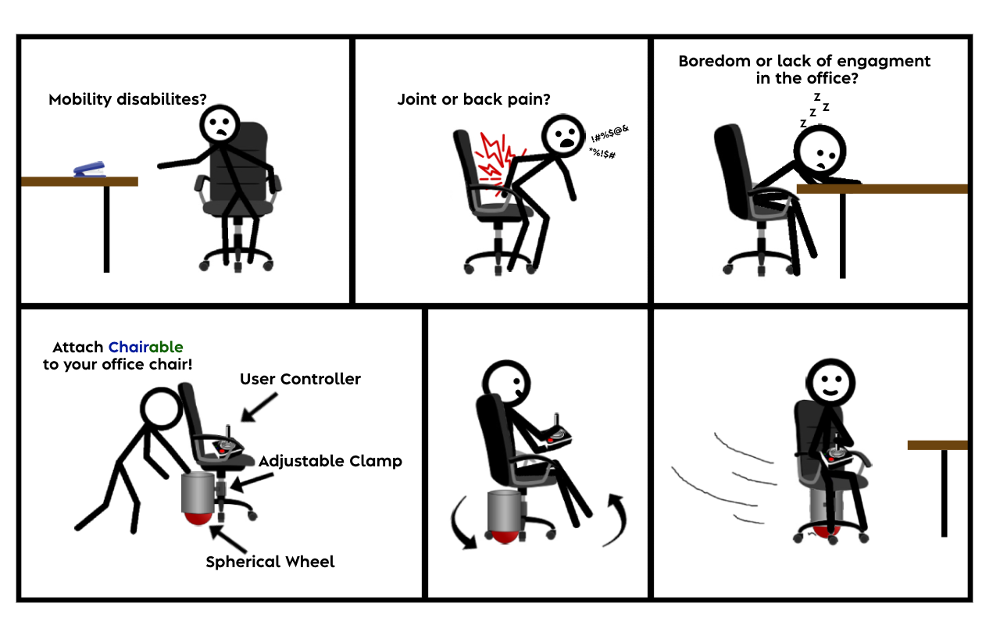

# Rolltech - Chairable

Roll Technology presents Chairable, a revolutionary product designed to explore the immature field of spherical wheel technology.

- Chairable utilizes a spherical wheel design for tight maneuvering and a space-efficient footprint
- Leverages an adjustable clamping mechanisim to enable modular attachment to a variety of office chairs
- A large 7000mAh lithium polymer battery and a powerful 2200W motor provide the ability to move a 125kg load at a 2.5m/s pace
- Uses a carefully crafted mechanical design implemented with machined steel and custom 3D printed elements
- A safe and robust experience is achieved through a fully enclosed electrical circuit with 14+ motor control, logic, and safety elements
- Operated remotely using a tailored PCB design, a custom controller casing, and a specifically crafted low-power circuit.

## About

Roll Technology is a Simon Fraser University based Capstone Project group comprised of 5 5th year engineering students.

## Folder structure

- PCB - Custom pcb design documents including KiCad schematics
- docs - Design related documentation, company branding, and user manual
- solidworks - Solidworks .STL and .SLDPRT files as well as drawn diagrams
- src - Arduino code relating to the controller device communication and logic
