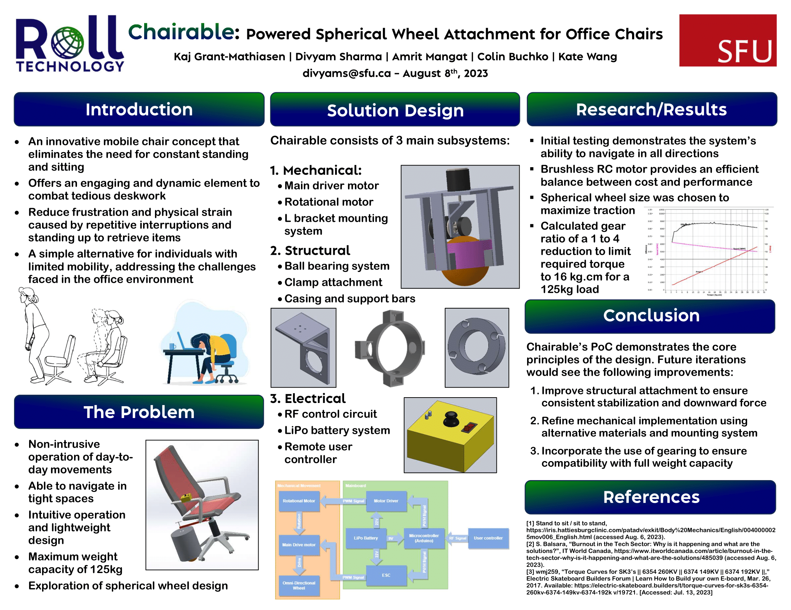

# Rolltech - Chairable

Roll Technology presents Chairable, a revolutionary product designed to explore the immature field of spherical wheel technology.

- Chairable is the embodiment of innovation, seamlessly integrating a battery-powered spherical wheel system, a strategically positioned footstand, and an effortlessly intuitive user interface.
- This ingenious attachment transforms your ordinary office chair into an extraordinary experience.
- With Chairable, users can effortlessly glide around while remaining comfortably seated, thanks to its user-friendly interface.
- Beyond its ergonomic design, Chairable stands out for its modularity, space-efficient footprint, and economical value.
- This versatile addition not only enhances the existing capabilities of office chairs but also exhibits superb adaptability across diverse workspaces and various floor surfaces.

## About

Roll Technology is a Simon Fraser University based Capstone Project group comprised of 5 5th year engineering students.
